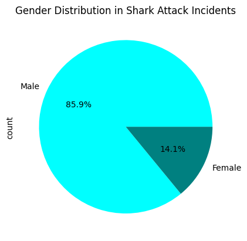
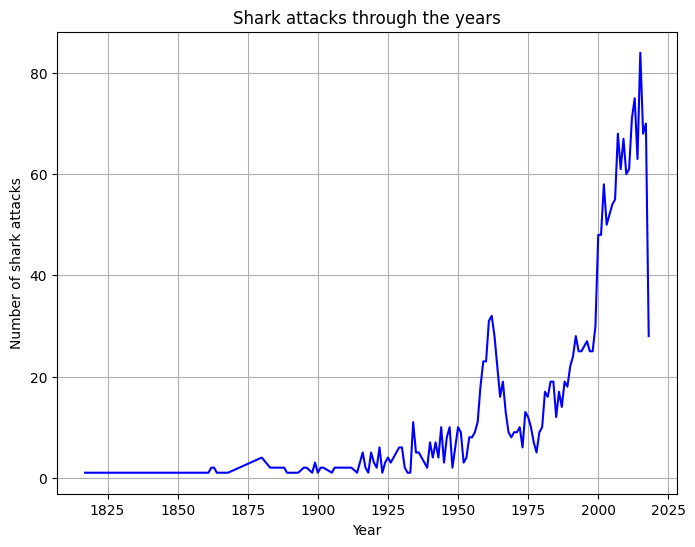
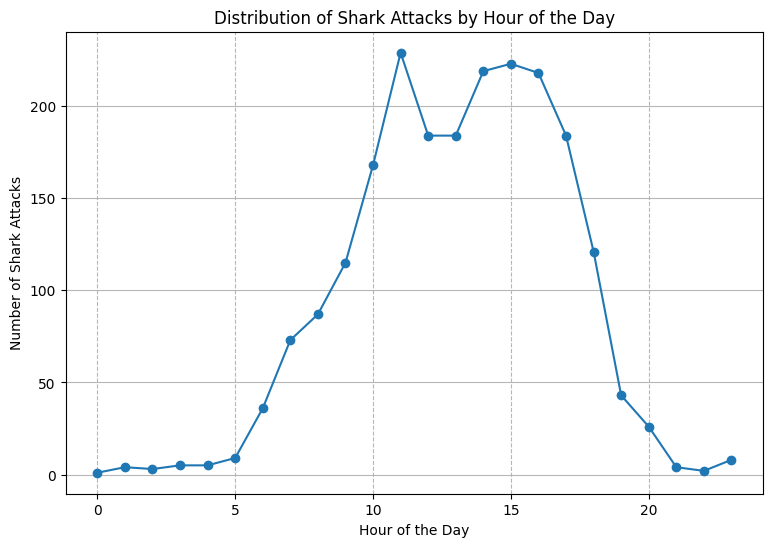
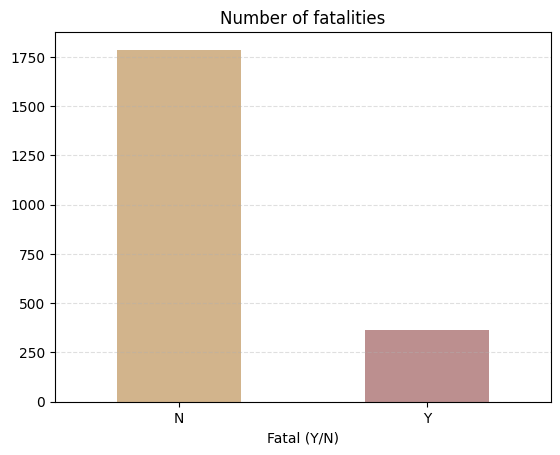

# Project 1| Marco  Ayora Arsic

# INTRODUCTION  

In this first project i have learned and put more into practice on how to analyse, clean and visualize data from a data set. The data set states about many factors on shark attacks throughout te years. After importing the csv file of shark attacks into my jupyter notebook i used some codes to see some of the data and analyse to see which questions and hypothesis i will be asking myself. Some examples were(shark.info, shark.nunique(), shark.columns...).

After looking at all the data i asked myself this 4 questions:

1.Which humman gender is tastier for sharks?

2.Have sharks entered a pro-vegan movement?

3.Do sharks procrastinate their lunchtime?

4.Do sharks like to bully humans?

## Project Description:
 At first i imported all the libraries i will have to use in advance such as pandas, numpy, matplotlib, seaborn and warnings. Then i defined a cleaning function called def clean(sharks). Inside the cleaning, function i have eliminated all the missing values from the columns i will use. Then Change the sex column name because it had an unnecessary space at the end. Creating a new data frame for the columns i will use;
 (Year, time, sex, activity, fatal(Y/N), injury). In addition I am taking out any year that is smaller than 1000 from the year column to remove wrong data as well as changing the f and m in the sex column for female and male to make it more readabale. For the activity column i make all the values with no capitalized letter so i won't get any  issues with that later on. In the year column to make the years in their propper format and take out all the decimals the years i have converted all the values into integers. 
 Then proceeding to the Time column using regex i extracted only the values i wanted which where only the proper and exact times. Meaning that i excluded the time ranges and type descriptions like evening and afternoon. I then droped all the missing values of the row time.

For the question.
### 1.Which human gender is tastier for sharks?
 including all into a function i mention the needed column in this case the 'sex' one and create a plot bar graph. After first visualising the data we see it was not completly clean. There are two answers that had to be cleaned 'M' and 'lli'. As those two answers are real attacks that we just don't know we can either catalog them as unknow or take them out. In this case because there is only two and that won't make
 much difference to the end results we will eliminate them.
 I created a new list then only selecting what  i wanted to visualize the values of the column that are also in my list(Male and female). I then take out the missing values and finally plot a pie chart were i can see the clear difference, were 85.9% of  attacks were towards Males.
](images/gender_distr.png)

### 2.Have sharks entered a pro-vegan movement?
 For my second question function i decide to just in case only use years before 2023 in case there were some worng values in the column.  Then i only had to plot my line graph.
](images/attacks_year.png)

### 3.Do sharks procrastinate their lunchtime?
 In the third question i defined a  new column with only the values i wanted from the time column. Then to group by the hours of the x axis i used the value counts method. To finish i plotted the propper line graph.
](images/attacks_hour.png)

### 4.Do sharks like to bully humans?
 In this last question i though i could directly plot the bar chart graph but then realised that there were extra values i did not wanted so i had to add an extra function where i cleaned and only kept the Y and N values of the column. After this i could finally plot my bar chart graph.
](images/fatalities.png)

## Hipothesis for each question:

1.For some reason we do not know, the attacks to sharks are extremely higher to the male part. While their counter-part only form part of the 14.1% of the shark attacks produced, the male have an          unfortunately 85.9% participation.
 So do really sharks prefer to end with the patriarchy or is it that in terms of food they think of male and female as equals?
could it be that attacks are not food related and rather with other purpose?

2.Lets analyse and complement our earlier question about sharks. Thanks to the data analysed we have seen that from 1812 till today(2023) shark attacks have increased incredibly reaching the peak in 2015-2016.This leads us to the conclusion that sharks are not related with human activists to become vegan. In the other hand it is important to mark that between 1960 and 1970 the attacks peaked a lot as well as in the 2000s. Why? Y ou might ask yourselves, well i have not found any data related to shark attacks in the 60s but in the 2000s could be the increase in tourism around the globe as well as the increase in activities water related which could lead to a shark encounter.

3.We have previously seen that many of the attacks have increased through the years but why could that be? Do shark attacks usually occur at the same hour? Well yes and we could look for a correlation between human daily routines as the attacks mainly occur through the day while we usually take adventure into the dangerous sea the peak of attacks in the day is at 11:00h where there are more than 230 registred.
We can conclude that sharks are not procrastinators and are rather impacient of the arrival of humans to their habitat.

4.After analysing all these previous question we see a rather weird actitud about sharks. What instincts or needs, impulses sharks to act these way? Might it be that its just their animal instinct as they are hungry or found it rather funny catch their prey and  look at others suffer like in our same society happens? Well after looking at the rate of fatalties we found out that more that 1750 have been only injuries while 375 have been fatal. This really shows that sharks don't really enjoy us as our food but still prey us. might it be an accident or a darker reason behind it? Even with all this data the mistery remains unknowkn.

## Conclusion:

In conlusion we have confirmed many of our doubts and questions while learning on how to work on a data set. But some of  the misteries that we could resolve could be due to a lack of data or data wronlgy cleaned.Although some misteries might stay unsolved.